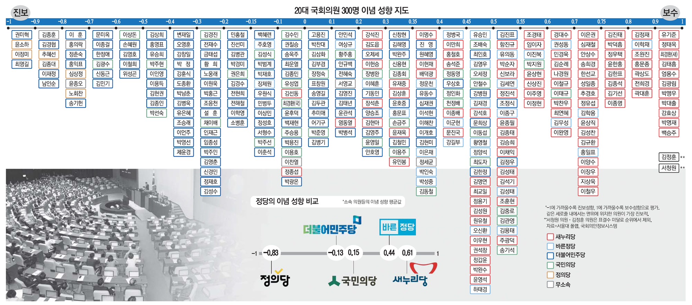

# 스크래핑 & 정치적 언급 


##### :white_square_button:기간과 언론사 설정

* 최근 기사를 토대로 스크래핑한 결과 '올림픽'이라는 키워드에 치우쳐져 있음을 확인하였습니다. 하여, 최근이되 도쿄올림픽으로부터 일정기간 텀을 둔 4/30 ~ 4/1 한달간 신문사의 기사를 스크래핑하였습니다. 중복되는 내용, 사진만 나와있는 기사 혹은 `.jpg`로 작성된 내용 등 분석에 타당하지 않은 기사는 제외하고 분석대상을 설정한 결과 한 언론사당 한달에 6,000~15,000개의 기사를 작성한다는 것을 확인할 수 있었습니다. 따라서 한달의 기간만으로 분석할 자료가 충분하다고 판단하였고 `경향신문, 국민일보, 중앙일보` 세 언론사의 한달간의 기사로 스크래핑을 한정하였습니다.


##### :white_square_button:스크래핑 출처와 방법

* 한국언론진흥재단이 서비스하는 뉴스분석 `API`를 통해 각 언론사의 제목과 관련 링크가 포함된 `.excel`파일을 이용할 수 있었습니다. 하지만,  본 프로젝트는 뉴스 전문에 대한 감성분석을 토대로 하기 때문에 각 언론사 기사의 링크에 접속해 전문을 스크래핑하였습니다.

  ```python
  # 엑셀을 살펴보고 제외할 부분 등에 대해 전처리하였습니다.
  df = df[df.tf != '예외']
  df = df[df.tf != '중복']
  df = df[df.tf != '중복, 예외']
  df = df[~df.title.str.contains('경향포토')]
  df = df[~df.title.str.contains('인터랙티브')]
  
  # 셀레니움 이용시 options로 `AdBlock'을 설치해서 팝업이나 속도문제를 제거했습니다.
  options = webdriver.ChromeOptions()
  options.add_extension(r'..//extension_3_11_1_0.crx')
  browser = webdriver.Chrome('..//chromedriver.exe', options=options)
  
  # 언론사에서 링크를 삭제하거나 변경시 판정 할 수 있도록 `def`를 설정했습니다.
  from selenium.common.exceptions import NoSuchElementException
  def check_exists_by_xpath(xpath):
      try:
          browser.find_element_by_xpath(xpath)
      except NoSuchElementException:
          return False
      return True
  
  # 스크래핑간에 버퍼를 주기위해 특정 코드가 나타날 때까지 일정시간 기다리는 셀레니움의 기능을 활용했습니다.
  from selenium.webdriver.support.ui import WebDriverWait
  from selenium.webdriver.support import expected_conditions as EC
  WebDriverWait(browser, 3).until(EC.presence_of_element_located((By.XPATH, "//p[@class='content_text']")))
  
  # 매일경제는 기사 내용에 해당하는 코드의 이름을 div.read_txt / div.art_txt / div.view_txt 로 분류하는 등 각 언론사 마다 본문에 해당하는 코드를 일일이 확인해야하는 점이 불편했습니다.
  
  # 본문스크래핑 내용을 엑셀에 추가할 때, 아래의 기능을 활용했습니다.
  df.values.tolist() / combine_list = list_1 + list_2 / df['칼럼명'] = list 
  ```


##### :white_square_button:Data to SQLite

* 분석한 내용을 `SQLite`에 넣을 때 `날짜, 언론사, 제목, 키워드, 링크, 전문, 판단, 판단내용, 긍정단어, 부정단어`로 칼럼을 구분하여 입력하였습니다.

  ```python
  # 데이터를 pd.DataFrame으로 불러와 sqlite에 저장하였습니다.
  import sqlite3
  db_news = sqlite3.connect('all.db')
  c = db_news.cursor()
  c.execute("CREATE TABLE newspapers (id INTEGER PRIMARY KEY AUTOINCREMENT, date TEXT, press TEXT, title TEXT, topkeyword TEXT, url TEXT, total_body TEXT, judge TEXT, judge_ko TEXT, pos_dict TEXT, neg_dict TEXT)")
  
  for row in df.interrows():
      # Ex. date = row[1][1] ... title = row[1][4] ...
      c.execute("INSERT INTO newspapers (date, press, title, topkeyword, url, total_body, judge, judge_ko, pos_dict, neg_dict) VALUES(?,?,?,?,?,?,?,?,?,?) ",(date, press, title, topkeyword, url, total_body, judge, judge_ko, pos_dict, neg_dict))
  db_news.commit()
  ```


##### :white_square_button:감정분석과 정치적 구분방법

* 먼저, 감정분석한 내용에 따라 `긍정 / 중립 / 부정`으로 각 기사에 라벨링을 하였습니다. 이에 대한 내용은  [딥러닝](https://github.com/tecktonik08/Team_Project02/tree/master/DL) 에서 설명합니다. 

* 정치적 편향성이라는 것은 다소 추상적인 단어일 뿐만아니라 이를 판단하는 것은 어려운 일입니다.  '편향'이라는 것은 주관의 영역이 될 수 있기 때문입니다.  따라서 본 프로젝트는 대상을 구체화하여 분석하였습니다. 먼저 정치언급 횟수를 카운트합니다. 정치언급이라 함은 정치인의 이름이 본문에서 빈출단어로 추출된 `keyword`에 포함되어있느냐의 여부에 따라 판별했습니다.

* 정치인의 진보/보수 성향은 `진보(-1)← 0 →보수(+1)`구간에 위치하게 됩니다. 이는  서울대 언론정보학과 한규섭 교수가 이끄는 폴랩(Pollab)연구팀, 폴메트릭스(입법 데이터 분석업체)가 20대 국회의원들을 대상으로 본회의에서 처리한 법안 표결 행태를 통계기법(W-NOMINATE)로 분석한 결과, 의원들 간의 상대적 이념위치를 수치화하는 방식을 따랐습니다. [기사1](https://news.joins.com/article/23724222), [기사2](http://m.raythep.com/newsView.php?cc=210001&no=12390) 

  


##### :white_square_button:정치적 언급 설정과 방법 & 시각화

* 정치인의 진보/보수 성향을 나타내는 자료는 20대 국회의원을 대상으로 하기 때문에 21대 국회의원리스트와  교집합을 통해 추출된 인원만을 이용하고자 하였으나, 교집합에 해당하는 인원은 119명이고 선거결과  재선된 국회의원 대부분이 `더불어민주당` 당적임을 확인할 수 있었습니다.  따라서 별도로 구분하는 것이 의미가 없다고 판단하여, 별도구분 없이 20대 국회의원 리스트를 통해 분석할 것을 결정하였습니다.

  ```python
  intersection = set(congress_20) & set(congress_21)
  ```

  

* 이로인해 필연적으로 진보측 정치인의 언급횟수가 높게 나올 수 없는 한계가 존재합니다. 그럼에도 불구하고 부정적 기사의 빈도수, 평균 언급 횟수, 타 언론사와의 가중평균결과를 비교하는 것으로도 의미가 있다고 판단하였습니다.

  ```python
  # home.views.analysis
  
  # 성향과 정치인 딕셔너리 설정
  score = {-0.95: ['홍익표', '여영국', '윤소하'],
               -0.9: ['한정애', '이정미', '추혜선', '김종훈', '심상정'], 		...}
  
  # 키 값을 그래프의 X축값으로 설정, 'x_keys' : keys
  keys = []
      for key, value in score.items():
          keys.append(key)
          
  # value에 대한 SELECT COUNT(*) 값을 정수로 sum하여서 .append를 이용해 리스트를 생성하였습니다. 그래프의 Y축값 설정시 이용
  for key, value in score.items():
      for i in value:
          cnt = c.execute("SELECT count(*) FROM newspapers WHERE topkeyword LIKE '%" + i + "%' ").fetchone()
              number = int(cnt[0]) ... +=
              
  # DB에서 꺼낼때, 두가지 조선의 교집합intersect을 충족한 내용의 SELECT COUNT(*)를 이용해 정치인이름&부정기사의 횟수를 추출했습니다.
  cnt_nega = c.execute(
                  "SELECT COUNT(*) FROM (SELECT * FROM newspapers WHERE topkeyword LIKE '%" + i + "%' intersect SELECT * FROM newspapers WHERE judge LIKE '-1')").fetchone()
  ```


* 시각화 : 감성사전의 불완전성으로 인해 부정단어의 비중이 긍정단어의 비중보다 높아 기사 판단의 결과가 긍정기사의 숫자는 미미한 수준입니다. 이는 실제로 긍정적 기사가 없는 점을 감안했을 때,  시각화 결과는 부정기사와 나머지기사, 2가지로 구분하여 나타냈습니다. 시각화 표의 특징을 고려하여 , `Stack bar chart`를 이용했습니다.

  ```html
  #
  	<script src='https://cdn.plot.ly/plotly-2.3.1.min.js'></script>
  <body>
  	<center>
  		<div id='bias'></div>
            <script>
              var trace1 = {
                x: {{ x_keys | safe}},
                y: {{ y_rests | safe}},
                name: 'rest article',
                type: 'bar'
              };
              var layout = {title: {text: 'politician_reference', xref: 'paper', x: 1,}}
            </script>
  	</center>
  ```

  

* 중도와 특정영역에 다수의 정치인들이 몰려있으면 당연히 빈도수가 많아질 것입니다. 따라서 total_refereence_cnt  ÷ number_of_value 로 average 값을 추가로 나타내었습니다 (일반 bar chart 이용)

  ```html
  #
  	<script src='https://cdn.plot.ly/plotly-2.3.1.min.js'></script>
  <body>
  	<center>
  		<div id='average'></div> ......
  ```

  


