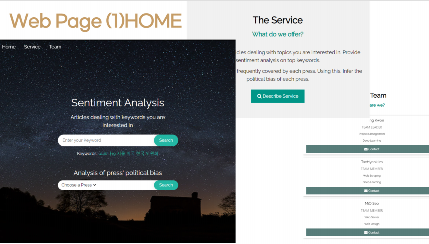
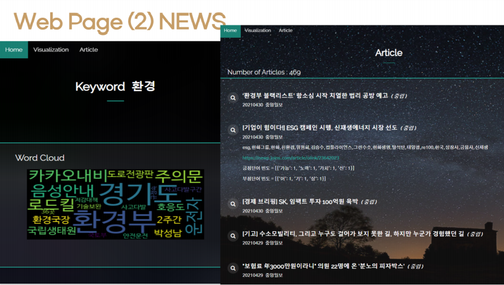
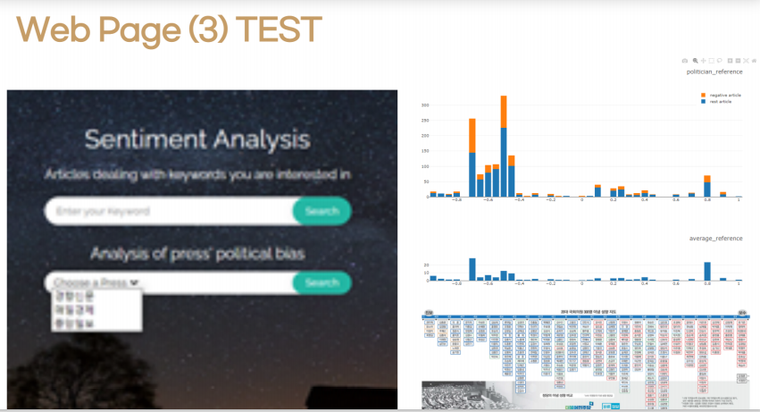

#  Web Server

 W3schools(https://www.w3schools.com/)을 참조해 웹 페이지를 구현했습니다.

#### :white_square_button:  페이지 구성

1. **home.html**

- 웹 페이지에 접속했을 때 나오는 첫 화면 입니다.

- 알고 싶은 키워드를 다룬 뉴스기사를 제공하는 게 목적이기 떄문에 단순하게 구성했습니다.
- `Enter your keyword`라 적혀있는 폼에 알고싶은 키워드를 입력하면,  그 키워드를 다룬 뉴스기사를 분석한 `news.html`로 넘어갑니다.
- `Sentimeni Analysis` 폼 밑에 가장 많이 기사로 쓰인 상위 키워드 5개 (코로나 19, 서울, 미국, 한국, 위원회) 를 입력했습니다.
- 언론사의 보도 경향성을 분석한 결과를 제공하는 `Analysis of press' political bias` 폼을 배치했습니다. `Choose a Press` 라 적혀있는 폼을 클릭하면 저희가 분석한 3개의 언론사 (경향신문, 중앙일보, 국민일보)가 리스트로 나옵니다. 궁금한 언론사를 클릭하고 서치를 누르면 `test.html`로 넘어가게 됩니다.
- 저희가 진행한 프로젝트 주제에 대해 설명한 컨테이너입니다. `Describe Service` 버튼을 누르면 나오는 모달창에 자세한 설명을 적어놨습니다. 그 밑에 팀원의 이름, 역할을 적어놓은 팀 컨테이너가 있습니다. `contact` 버튼을 누르면 각 팀원의 깃허브 페이지가 열립니다.

2. **news.html**

- 홈 화면에서 입력한 키워드를 헤더에 배치했습니다. 

- 키워드를 다룬 뉴스기사들이 가장 많이 언급한 단어를 시각화한 `WordCloud` 를 배치했습니다.

- 키워드를 다룬 뉴스기사들을 리스트로 쭉 나타냈습니다. 상단엔 기사의 총 개수가 나타나 있습니다.
- 뉴스기사의 타이틀, 긍정/부정/중립의 정도, 날짜, 언론사를 나타냈습니다. 각 기사를 클릭하면  탑 키워드, 기사 전문으로 연결되는 url, 긍정단어와 부정단어 빈도를 나타내는 collapse창이 열립니다.

3.  **test.html**

- 언론사를 선택하면, 그 언론사의 보도 경향성을 분석한 결과가 나옵니다.

- `ploty`를 활용해 그래프 형태로 나타냈습니다.
- 

#### :white_square_button:  

#### :white_square_button:  

